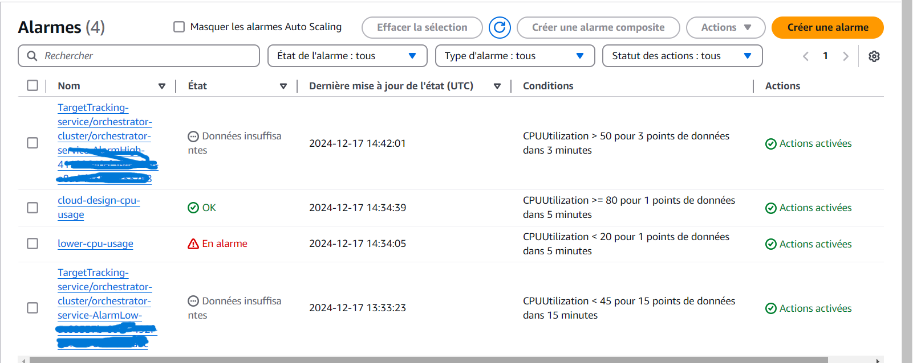
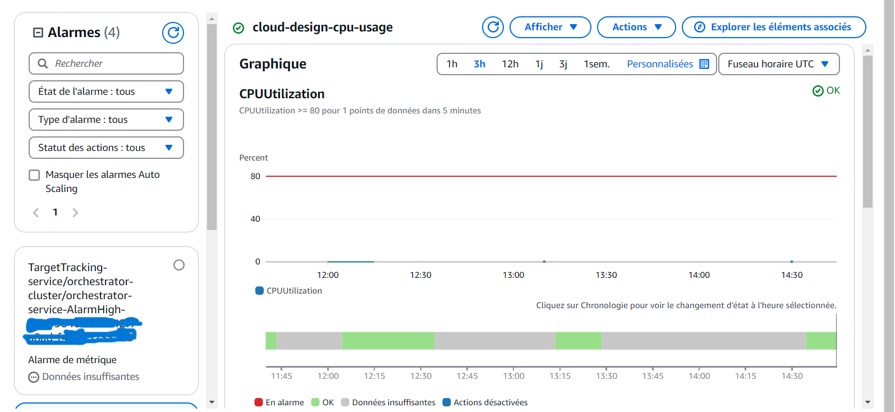
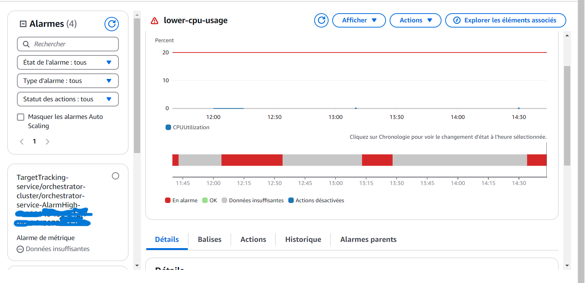
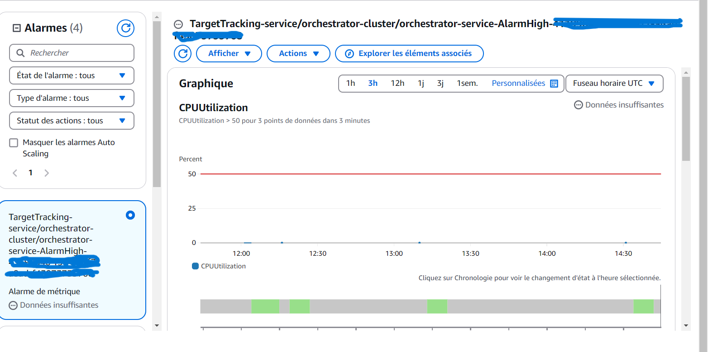

# Cloud-Design

More information about the project
[here](https://github.com/01-edu/public/blob/master/subjects/devops/orchestrator/README.md)

## Setup

In order to be able to run this application you need to have the following
programs installed on your machine:

- [Vagrant](https://developer.hashicorp.com/vagrant/docs/installation).
- [VirtualBox](https://www.virtualbox.org/wiki/Downloads).

To interact with the application, it is recommended to install the following
programs, or any equivalent ones:

- [Postman](https://www.postman.com/downloads/), or any other tool to
  programmatically test API endpoints.

## AWS Setup

To deploy this application on AWS, ensure you have the following setup:

1. **AWS CLI**: Install and configure the AWS CLI with your credentials.
2. **Docker**: Install Docker to build and push images.
3. **ECR**: Create an ECR repository and push your Docker image.
4. **ECS**: Create an ECS cluster and service using the provided task definition.
5. **S3**: Create an S3 bucket for storage and ensure your ECS task has the necessary permissions.
6. **Networking**: Ensure your ECS service is using the correct VPC, subnets, and security groups.
7. **CloudWatch**: Used CloudWatch for Logging and metric monitoring. It was set to alarm when CPU usage is above 80% or less than 20%. Metric dashbord is created to visualise the service metrics and attached to our ECS.
8. **(Optimization) Auto Scaling**: Implement auto-scaling policies to handle varying workloads and ensure high availability.

### Example Commands

**Build Docker Image**:
```sh
docker build -t orchestrator:latest .
```
**Create ECR Repository**:
```sh
aws ecr create-repository --repository-name orchestrator
```
**Push Docker Image to ECR**:
```sh
aws ecr get-login-password --region <your-region> | docker login --username AWS --password-stdin <your-account-id>.dkr.ecr.<your-region>.amazonaws.com
docker tag orchestrator:latest <your-account-id>.dkr.ecr.<your-region>.amazonaws.com/orchestrator:latest
docker push <your-account-id>.dkr.ecr.<your-region>.amazonaws.com/orchestrator:latest
```
**Create ECS Cluster**:
```sh
aws ecs create-cluster --cluster-name orchestrator-cluster
```
**Register Task Definition**:
```sh
aws ecs register-task-definition --cli-input-json file://task-definition.json
```
**Create ECS Service**:
```sh
aws ecs create-service \
    --cluster orchestrator-cluster \
    --service-name orchestrator-service \
    --task-definition orchestrator-task \
    --desired-count 1 \
    --launch-type FARGATE \
    --network-configuration "awsvpcConfiguration={subnets=[<your-VPC-subnet-id>],securityGroups=[<your-security-group-id>],assignPublicIp=ENABLED}"
```
**Describe ECS Service**:
```sh
aws ecs describe-services --cluster orchestrator-cluster --services orchestrator-service
```
**S3 Setup**:
- Create S3 Bucket:
On your AWS platform, create an S3 bucket and use the name `cloud-bkt-design`.
- Configure IAM Role for S3 Access:
Go to the IAM console and select the role you have created for your service (e.g., ecsTaskExecutionRole).
Attach the `AmazonS3FullAccess` policy to the role.
- Get latest task definition on cli:
```sh
aws ecs list-task-definitions --family-prefix orchestrator-task
```
- Update ECS Service again:
 ```sh
 aws ecs update-service --cluster orchestrator-cluster --service orchestrator-service --task-definition orchestrator-task:<latest-task-definition>
 ```
- Verify service again:
```sh
aws ecs describe-services --cluster orchestrator-cluster --services orchestrator-service
```
**Auto Scaling Setup**
- Register Scalable Target:
```sh
  aws application-autoscaling register-scalable-target `
    --service-namespace ecs `
    --resource-id service/orchestrator-cluster/orchestrator-service `
    --scalable-dimension ecs:service:DesiredCount `
    --min-capacity 1 `
    --max-capacity 10
```
- Create Target Tracking Scaling Policy:
```sh
  aws application-autoscaling put-scaling-policy `
    --service-namespace ecs `
    --resource-id service/orchestrator-cluster/orchestrator-service `
    --scalable-dimension ecs:service:DesiredCount `
    --policy-name cpu-target-tracking-policy `
    --policy-type TargetTrackingScaling `
    --target-tracking-scaling-policy-configuration file://target-tracking-scaling-policy.json
```
### Demo
Below are examples of logs and alarm notfictaions set up for our service with aws cloudwatch. these alarm notfications are sent to my email each time the specified trigger is activated.





### Summary
- **Set Up AWS S3**: Create an S3 bucket and configure IAM roles for access.
- **Update Task Definition**: Ensure it includes necessary configurations for S3 access.
- **Verify Networking Components**: Ensure VPC, subnets, and security groups are correctly configured.
- **Verify EC2 Instances**: Ensure EC2 instances are set up if using EC2 launch type. In this case we are using `FARGATE` (a serverless ECS container engine with authomatic scalibility for cost effectiveness).


By following these steps, you can ensure that all necessary components are set up to deploy your ECS service and run successfully on AWS cloud.